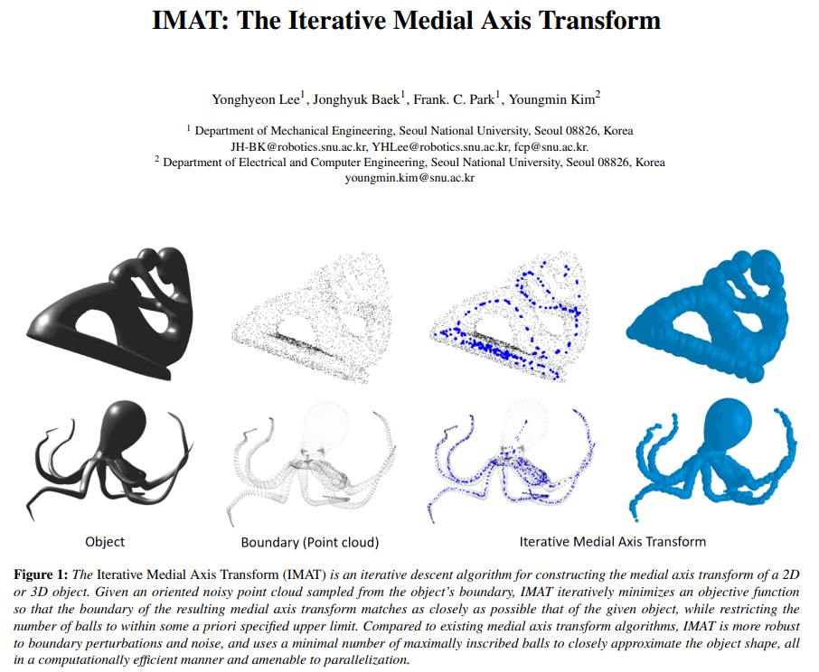

### TL; DR
__Iterative Medial Axis Transform (IMAT)__ produces a medial axis transform for a sparse, noisy, oriented point cloud sampled from an object's boundary. Comparing to the other algorithms, we demonstrate the noise robustness, shape fidelity, and representation efficiency of the IMAT.

### Preliminaries  
